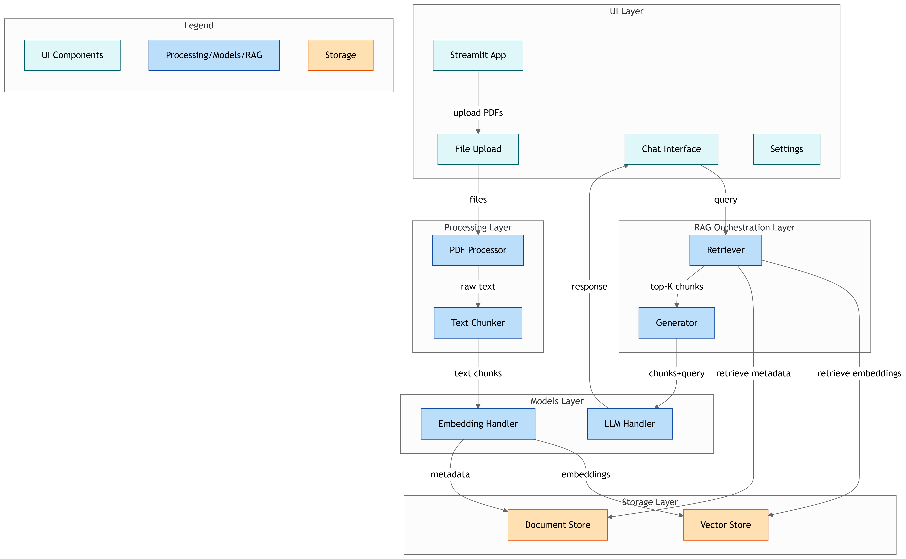

# 📚 RAG Pipeline Project Structure

## Directory Structure
```
rag-pdf-pipeline/
├── README.md
├── STEPS.md
├── pyproject.toml
├── requirements.txt
├── .env.example
├── .gitignore
├── src/
│   ├── __init__.py
│   ├── config.py
│   ├── models/
│   │   ├── __init__.py
│   │   ├── llm_handler.py
│   │   └── embedding_handler.py
│   ├── storage/
│   │   ├── __init__.py
│   │   ├── vector_store.py
│   │   └── document_store.py
│   ├── processing/
│   │   ├── __init__.py
│   │   ├── pdf_processor.py
│   │   └── text_chunker.py
│   ├── rag/
│   │   ├── __init__.py
│   │   ├── retriever.py
│   │   └── generator.py
│   └── utils/
│       ├── __init__.py
│       └── logger.py
├── ui/
│   ├── __init__.py
│   ├── streamlit_app.py
│   ├── components/
│   │   ├── __init__.py
│   │   ├── file_upload.py
│   │   ├── chat_interface.py
│   │   └── settings.py
│   └── styles/
│       └── main.css
├── data/
│   ├── uploads/
│   ├── vector_db/
│   └── chat_history/
├── tests/
│   ├── __init__.py
│   ├── test_pdf_processor.py
│   ├── test_vector_store.py
│   └── test_rag_pipeline.py
└── scripts/
    ├── setup.bat
    └── run.bat
```


## 🚀 Installation/Setup

To set up the project, follow these steps:

1.  **Clone the repository:**

    ```bash
    git clone https://github.com/your-repo/rag-pdf-pipeline.git
    cd rag-pdf-pipeline
    ```

2.  **Install dependencies:**

    This project uses `uv` for dependency management. If you don't have `uv` installed, you can install it via pip:

    ```bash
    pip install uv
    ```

    Then, install the project dependencies:

    ```bash
    uv sync
    ```

3.  **Environment Variables:**

    Create a `.env` file in the root directory based on `.env.example` and fill in your API keys and other configurations.

    ```
    # .env example
    OPENAI_API_KEY=your_openai_api_key_here
    # Add other necessary environment variables
    ```

## ✨ Features

This RAG pipeline project provides the following key features:

*   **PDF Document Processing:** Utilizes `pdf_processor.py` to extract text from PDF documents.
*   **Text Chunking:** Efficiently breaks down large texts into manageable chunks for processing.
*   **Embedding Generation:** Generates vector embeddings for text chunks using a dedicated `embedding_handler.py`.
*   **Vector Storage and Retrieval:** Stores and retrieves document embeddings using a `vector_store.py` for efficient similarity search.
*   **LLM Integration:** Integrates with Large Language Models via `llm_handler.py` for generating responses based on retrieved information.
*   **Streamlit User Interface:** Provides an interactive web interface for uploading PDFs, chatting with the RAG model, and configuring settings.

## 🏗️ Project Modules/Architecture

The project is organized into several modules, each responsible for a specific part of the RAG pipeline:

*   `src/`: Contains the core logic of the RAG pipeline.
    *   `src/models/`: Handles interactions with LLMs and embedding models.
    *   `src/processing/`: Manages document processing, such as PDF parsing and text chunking.
    *   `src/rag/`: Implements the retriever and generator components of the RAG system.
    *   `src/storage/`: Deals with document storage and vector database operations.
    *   `src/utils/`: Provides utility functions like logging.
*   `ui/`: Contains the Streamlit web application and its components.
*   `static/`: Stores static assets like images and example documents.
*   `scripts/`: Holds various utility scripts for setup and running the application.
*   `logs/`: Directory for application logs.

### ▶️ Usage

To use the RAG pipeline, follow these steps:

1.  **Start the Streamlit Application:**

    ```bash
    streamlit run ui/app.py
    ```

2.  **Interact with the UI:**

    *   **Upload PDF:** Use the file uploader to select a PDF document. The application will process the document, extract text, chunk it, and generate embeddings.
    *   **Chat:** Once the document is processed, you can type your questions into the chat input field. The RAG model will retrieve relevant information from the document and generate a response.
    *   **Settings:** Adjust various parameters like the chunk size, overlap, and model settings through the sidebar.

## System Diagram


